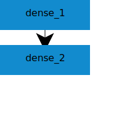

## About 
Our project is a visualization tool for machine learning models. Users can upload a Keras model summary on our webpage, and we display a graph of the uploaded model. We also allow the users to download the graph as png or svg. All the functionalities are provided to the users via our webpage. Our backend has two main components: Summary Parser and MViz. Summary Parser parses the uploaded summary file to json. 

## Documents
1. [Pre-Proposal](https://docs.google.com/document/d/11VjVbnrdtLFARIkFrQ3rdm4bb8CHYZZmuRtVR1-xrUM/edit)
 
2. [Proposal](https://docs.google.com/document/d/1LgDc-OYKpsFjJo7SXt3g7Em7Xy7-EwyqUtp0sjciss0/edit#heading=h.3yivhv19jvez)

3. [Design](https://docs.google.com/document/d/1xwX6gX7O9E6p5tGXUsuVQumuhVhx2VPttQ1GZyWJ5qA/edit?usp=sharing)

4. [Final Report](https://docs.google.com/document/d/1edWxtWV8yMIB7xgIR7XZmJ8OU8NvNwFi2V-W2rxQW3Y/edit?ts=5cfee950#)

## Demo
To run the demo,
first install all dependencies
```
npm install
```
Start a local server
```
npm run dev
```
This should open a webpage on localhost:8080.
You can upload a file in `./demo/input` and see the visulization.

### Motivating Example



To draw the above graph using d3, you may need 
```js
{
  "rect": [
    {
      "x": 0,
      "y": 0,
      "label": "dense_1",
      "width": 150,
      "height": 50,
      "type": "Dense",
      "name": "dense_1"
    },
    {
      "x": 0,
      "y": 75,
      "label": "dense_2",
      "width": 150,
      "height": 50,
      "type": "Dense",
      "name": "dense_2"
    }
  ],
  "links": [
    {
      "source": "dense_1",
      "destination": "dense_2"
    }
  ]
}
```
This is very tedious and error prone for just two layers. Instead, using MViz, you can simply upload the summary file of your Keras model. 